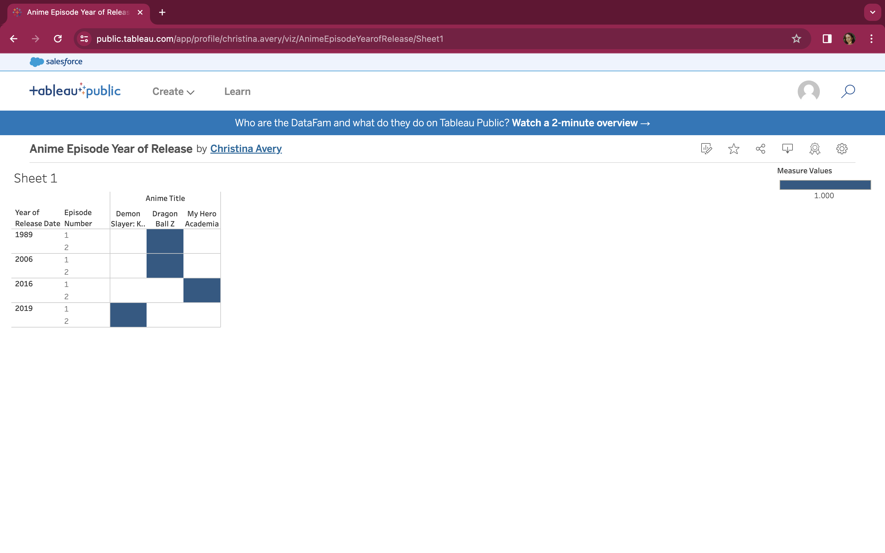

**Project Name:** SushiRoll Anime Streaming Service Database
- **Tools Used:** MySQL, Tableau, SQL
- **Overview:** In this project, I've established a fully functional database for a fictional anime streaming service. This project showcases my comprehensive skills in database management, SQL proficiency, and data visualization.

---

**Database Design and Implementation:**

1. **MySQL Setup and Database Creation:**
   - Successfully installed and configured MySQL on my local environment.
   - Initiated and managed the `SushiRoll` database, setting the foundation for the streaming service's data management.

2. **Database Schema Design:**
   - Developed an intricate network of tables: User, Anime, Episode, UserAnimeHistory, SubscriptionPlan, PaymentTransaction.
   - Concentrated on creating a schema that mirrors realistic business processes and data associations.
   - Reverse Engineered an ER-Diagram on MySQL workbench for ease of schema navigation.

3. **Data Integrity and Relationship Management:**
   - Meticulously defined primary and foreign keys across tables, ensuring data integrity and establishing clear relational links.
   - Demonstrated a deep understanding of entity relationships pertinent to a streaming service.

4. **Data Type Proficiency:**
   - Utilized a diverse range of data types (INT, VARCHAR, ENUM) and constraints (NOT NULL, UNIQUE, AUTO_INCREMENT), reinforcing data consistency and appropriate formatting.

---

**Data Manipulation and Management:**

1. **Data Insertion:**
   - Employed SQL `INSERT` statements for initial data population, simulating an active, real-world database environment.

2. **Complex Query Construction:**
   - Designed SQL views (`UserAnimeHistoryView` and `AnimeEpisodeView`) to streamline data access, critical for analytical and reporting objectives.

---

**Database Maintenance and Operations:**

1. **Data Cleaning:**
   - Conducted data cleaning tasks, including truncating tables, showcasing my capability in maintaining data quality.

2. **Foreign Key Checks:**
   - Skillfully managed foreign key constraints, further underscoring my proficiency in maintaining data integrity.

---

**Integration with Data Analysis Tools:**

1. **Tableau Integration:**
   - Carefully prepared and structured SQL data for integration with Tableau.
   - Created SQL views tailored for insightful data visualization and analysis.

---

**Visualizations:**

*Insert your visualization images or PNG files here.*

- **Visualization 1:** [Description]
 
  

- **Visualization 2:** [Description]
 
  

*Descriptions should explain the insights and relevance of each visualization.*

---

**Conclusion:**

Through the ‘SushiRoll’ project, I've demonstrated a comprehensive array of skills essential for a Data Professional, from setting up and managing a MySQL database to creating meaningful visualizations in Tableau. This project not only showcases my technical understanding but also my ability to apply these skills effectively in a business context.
